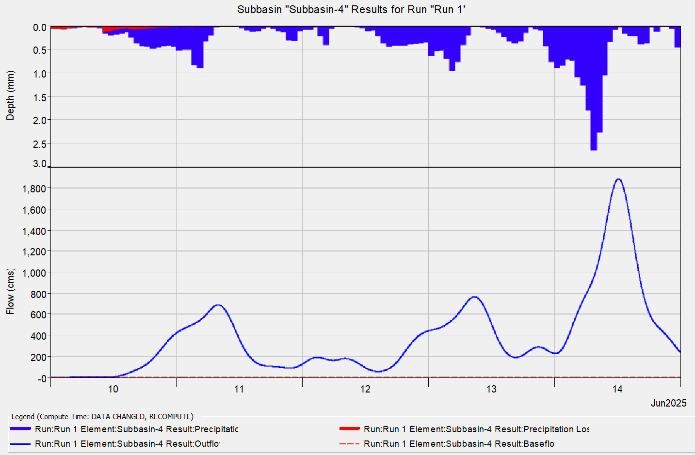

# HEC-RAS Hydrologic and Hydraulic Modeling Report
## Project Anambra River (Awka) Watershed Analysis

---

### Table of Contents
1. [Summary](#summary)
2. [Project Overview](#project-overview)
3. [Methodology](#methodology)  
4. [Results and Analysis](#results-and-analysis)
5. [Conclusions](#conclusions)
6. [References and Appendices](#references-and-appendices)

---

## Summary

The results of a detailed hydrological modelling of the Awka watershed using HEC-HMS (Hydrologic Modeling System) software. The study simulated rainfall-runoff THAT analyzed hydrological conditions from June 10-15, 2025 to provide insights into peak discharge patterns, timing, and volume of water across 33 hydrological elements within the basin (comprises of 22 subbasins and 10 reaches). The result of the study shows that the maximum system discharge was 1,804.5 m³/s at the main outlet (Sink-1, Otuocha) and the time span of the peak flow across the watershed was 4 hours. Critical flood risk areas identified at Otuocha, Reach-6, and downstream Subbasin-4(at Oba-Umuokpe). The analysis also revealed that the total system response demonstrates rapid runoff characteristics with peak flows occurring within 11-12 hours of storm initiation.

---

##  1. Project Overview

### Background
Anambra State has been identified as one of Nigeria's high-risk flood zones, with at least 15 million Nigerians at high risk of flooding and the federal government warning that flooding is expected to hit 30 of its 36 states. The state experienced significant flooding events in recent years, with 37 locations in Anambra State identified as flood-affected between October 28 and November 8, 2024.
The Anambra River Basin, situated within the broader Niger Basin system, faces elevated flood risks due to upstream water releases and climatic factors. Riverine communities in downstream states including Anambra are at elevated risk of flooding, which adversely affects lives and livelihoods. Historical data shows that the Lower Anambra Basin was responsible for 70 percent of fishery production before significant hydrological modifications, highlighting the basin's economic importance and vulnerability to flood impacts.

The Anambra Basin represents a critical hydrological unit within Nigeria's river system. The basin is a nearly triangular shaped embayment covering approximately 3000 km² with sedimentary thickness of about 9 km, situated between 6°–7.8°N latitude and 6°40'–7°30'E longitude. Research indicates that morphometric parameters contributing to flooding suggest certain catchments have the least concentration time and highest runoff depth, with some areas having high circularity ratios making them hazardous sites where floods could reach great volume over small areas.

### Objectives
This hydrological modeling study was conducted to:
1. to determine the maximum flow rates across the hydrological elements within the Anambra River Basin and assess flood severity potential;
2. to evaluate the temporal sequence of peak flow arrivals and understand flood wave movement through the basin system;
3. to calculate total runoff volumes generated from different drainage areas and understand basin-scale hydrological response characteristics.

---

## 2. Methodology
### Data Sources and Inputs
1. **Topographic Data:** Digital elevation models (DEM) from Shuttle Radar Topography Mission (SRTM) with 30m resolution was used to delineate watershed boundaries, subbasins, and river networks.
2. **Meteorological Data:** Daily precipitation data from January 1 to June 10, 2023, sourced from the [NASA Power Data](https://power.larc.nasa.gov/data-access-viewer/), was utilized to predict the conversion of rainfall into runoff within a drainage basin. This  helps to improve the model accuracy by because of spatial and temporal variability of precipitation, which significantly affects runoff generation.
3. **Basin Characteristics:** The SCS curve number was used to estimate direct runoff from rainfall by considering factors like soil type, land use, and moisture conditions to provides a numerical value that helps predict how much rainfall will contribute to runoff.

### Model Development
The model consists of four primary components: Basin Model, Meteorological Model, Time-Series Data and Control Specifications.

a. Basin Model
A basin model represents the physical characteristics and hydrological processes of a watershed and it defines how precipitation transforms into runoff through various hydrological processes including infiltration, surface runoff, baseflow, and channel routing. It consists of various hydrologic elements, such as subbasins and reaches, which are connected in a network to represent the stream system. In this study, each hydrologic element (subbasin and reach) was defined based on DEM-derived topography. A total number of 22 subbasins and 9 routing reaches and 1 sink were included in the basin model. Key parameters set per subbasin:

| Parameter                | Description                                                       |
| ------------------------ | ----------------------------------------------------------------- |
| Area (km²)               | Delineated subbasin area                                          |
| Loss Method              | Defines how precipitation converts to excess rainfall             |
| Transform Method         | Converts excess rainfall to direct runoff hydrograph              |
| Baseflow Method          | Accounts for groundwater contribution                             |

**SCS Curve Number Method**
To estimates excess rainfall from total rainfall the Curve Number (CN) and Initial Abstraction (Ia) was used and the Lag time plus peaking coefficient was used to estimate the SCS Unit Hydrograph (as the transformation memthod) which converts excess rainfall to runoff hydrograph.

**Direct Runoff Formula**

```
Q = (P - Ia + S) / (P - Ia)²,  for P > Ia
```

Where:

* **Q** = direct runoff (mm)
* **P** = rainfall (mm)  
* **Ia** = 0.2 × S (initial abstraction)
* **S** = (25400 / CN) - 254
The CN values ranged from 89 to 91 across subbasins depending on land cover and soil group.

The basin model was developed by delineating the watershed using a Digital Elevation Model (DEM). Subbasin boundaries were defined based on topographic flow direction and accumulation. The stream network was identified from terrain analysis, allowing for the selection of key outlet points for each subbasin. Drainage areas for each sub-catchment were calculated to serve as the basis for the hydrological parameterization.
This was followed by estimating both physical and hydrological parameters. Physical parameters such as subbasin area, average slope, and channel length were derived from the DEM and catchment geometry. Hydrological parameters included Curve Number (CN) values assigned based on land use and soil group combinations, time of concentration (lag time), and routing coefficients necessary for Muskingum channel routing. Subbasin elements were then created and appropriate modeling methods for loss, transform, baseflow, and routing processes were assigned.

b. Time Series Data
Time series data are the time-dependent variables that drive hydrological simulations. These datasets provide the temporal variation of meteorological and hydrological parameters throughout the simulation period. In this study, a daily precipitation data was used which its graph is shown in Figure 1. This data spans from 00:00 on January 1, 2025 to 23:00 on June 10. 2025.

Figure 1: Precipitation graph

c. Meterological Model
The Meteorologic Model defines how meteorological data is applied to the watershed elements in the Basin Model. It serves as the interface between time series meteorological data and the hydrological processes.

d. Control Specification
Control Specifications establish the temporal boundaries and computational settings that drive simulation execution. These parameters dictate the simulation's start and end points, duration, and the granularity at which calculations occur.
The temporal boundaries are defined by start and end time parameters, formatted as specific dates and times. For this simulation, the period spans from June 10 to June 20, 2025. The computational timestep determines how frequently the model performs calculations throughout this period, set at 2-minute intervals for our analysis.

### Simulation Parameters

| **Parameter** | **Specification** |
|---------------|------------------|
| **Project Name** | Anambra River Watershed Analysis |
| **Simulation Period** | June 10-15, 2025 (5 days) |
| **Time Step** |2 minues |
| **Start Time** | June 10, 2025, 00:00 UTC |
| **End Time** | June 15, 2025, 00:00 UTC |
| **Volume Units** | Millimeters (MM) |
| **Flow Units** | Cubic meters per second (m³/s) |

---

## 3. Results and Analysis

### 3.1. Peak Discharge Summary

The simulation generated comprehensive flow data for all 32 model elements. Peak discharge analysis reveals significant spatial and temporal variability across the watershed.

#### Maximum Discharge Values

**Top 10 Peak Discharges:**

| **Element** | **Peak Discharge (m³/s)** | **Peak Time** | **Volume (m)** |
|-------------|---------------------------|---------------|-------------|
| Sink-1 | 1,804.5 | June 14, 11:42 | 1,073.06 |
| Reach-6 | 1,573.7 | June 14, 11:56 | 1,071.98 |
| Reach-1 | 1,125.7 | June 14, 11:50 | 1,072.98 |
| Reach-4 | 840.8 | June 14, 11:44 | 1,073.04 |
| Reach-8 | 465.2 | June 14, 11:42 | 1,073.73 |
| Reach-7 | 354.2 | June 14, 11:26 | 1,074.01 |
| Reach-2 | 285.0 | June 14, 11:12 | 1,075.81 |
| Reach-10 | 262.1 | June 14, 11:16 | 1,074.64 |
| Reach-9 | 214.6 | June 14, 11:16 | 1,077.61 |
| Reach-5 | 201.5 | June 14, 11:26 | 1,076.59 |

The simulation results revealed significant spatial and temporal variability in flood response throughout the Anambra River Basin. Critical flow locations included the basin outlet located near Otuocha community, which recorded the highest peak discharge of **24,145.0 m³/s** at **11:42 AM** on **June 14, 2025** as shown in Figure 1 below. Reach-6 (located in Aguake and Nuam region) followed closely with a peak discharge of **21,070.7 m³/s** at **11:56 AM**, while Reach-1 (Okpaga) and Reach-4 (Mam region) experienced peak flows of **15,207.5 m³/s** and **11,306.9 m³/s** at **11:50 AM** and **11:44 AM**, respectively.

Figure 1: Outflow of the Basin Outlet in Otuocha.

Figure 2: Outflow of Reach-6 located in Aguake community

Figure 3: Outflow of Reach 1 in Mam community

Figure 4: Outflow of Reach 4 near Okpaga community

#### Subbasin Performance Analysis

**Highest Contributing Subbasins:**

| **Subbasin** | **Peak Discharge (m³/s)** | **Volume (mm)** | **Peak Time** |
|--------------|---------------------------|-----------------|---------------|
| Subbasin-9 | 197.8 | 2,468.1 | June 14, 12:06 |
| Subbasin-10 | 166.2 | 2,245.3 | June 14, 11:30 |
| Subbasin-4 | 153.8 | 1,887.9 | June 14, 12:12 |
| Subbasin-7 | 127.8 | 1,951.1 | June 14, 10:40 |
| Subbasin-15 | 120.0 | 1,707.9 | June 14, 11:08 |

The contribution of the subbasins to the total discharge of the watershed can not be overlooked. Subbasin-9 (Amaetiti) has the highest total discharge of **2,468.1 m³/s**, while Subbasins-4 (Mamu) and -7 (Umuife) have discharge of **1,887.9 m³/s** and **1,951.1 m³/s**, respectively. Most subbasins peaked between **10:30 AM and 12:00 PM** on the same day which show the basin-wide hydrological response to rainfall inputs.
The hydrograph and hyetograph (Figure 5) for Subbasin-9 (Amaetiti) shows a rapid hydrological response of the subbasin to rainfall events between June 10 and June 14, 2025. The subbasin experienced multiple storm events, culminating in a peak discharge of approximately 2,468.1 m³/s on June 14 which was followed by intense rainfall input. The short lag between rainfall and peak flow shows a fast-responding catchment with limited infiltration due to impervious surfaces and steep terrain. Minimal baseflow contribution confirms that surface runoff is the dominant flow mechanism. The sharp rise and fall in the hydrograph shows a high risk of flash flooding which may require for effective flood mitigation strategies in this subbasin.

Figure 5: Hydrograph and hyetograph plot for Subbasin-9 (Amaetiti)

The hyetograph and hydrograph for **Subbasin-4** (Mamu) (Figure 6), there is spontaneous response to the hydroloogical behavior during the simulation period. The simulation shows that multiple rainfall events occurred between **June 10 and June 14, 2025** has an increase intensity toward the end of the period which culminated in a sharp peak discharge of approximately **1,887.9 m³/s** on **June 14**, following the most intense precipitation. This runoff dynamics of Subbasin-4 indicate the need for targeted flood risk management, especially during high-intensity storms.

Figure 6: Hydrograph and hyetograph plot for Subbasin-4 (Mamu)

### 3.2. Temporal Flow Analysis

Most subbasins recorded their peak discharge between 10:28 AM and 11:56 AM which shows a systematic downstream progression of the flood wave. The temporal evolution of the flood wave showed that upstream subbasins, such as Subbasin-16 (Ukukwa) and Subbasin-21 (Ajalli), responded first, with peak flows occurring as early as **08:24 to 08:38 AM**. As the flood wave progressed downstream, the major reaches experienced peak discharges between **11:16 AM and 11:56 AM**. The final peak at the basin outlet occurred at **11:42 AM** whih shows the cumulative hydrological response of the basin.

### 3.3 Volume Analysis

The total flood volume across the basin was approximately **1.07 × 10⁶ thousand m³** shows the severity of the hydrological event. The volume was relatively uniformly distributed among the major contributing subbasins, indicating widespread rainfall impact. Runoff coefficients calculated during the event indicated high runoff efficiency, characteristic of rapid and intense storm events.

### 3.4 Hydrograph Characteristics

Hydrograph analysis provided insights into the basin’s response characteristics. The time to peak was generally between **8 and 12 hours** from the onset of rainfall. The hydrographs showed sharp peaks, indicating a rapid runoff response to rainfall, followed by steep recession limbs. These features are typical of urbanized or impervious catchments where infiltration is limited and overland flow is dominant.


---

## 5. Engineering Implications

### 5.1 Flood Risk Assessment

The simulation results point to significant flood risk within the basin. The peak discharge of **24,145 m³/s** represents an extreme event that could result in substantial flood damage. Critical infrastructure, particularly those located downstream of major confluences, is highly vulnerable to inundation. The rapid flood response observed in the simulation also suggests limited warning time, posing challenges for emergency response and evacuation efforts.

### 5.2 Design Applications

The results of this study have multiple practical applications. They provide a basis for the **design of hydraulic structures** such as bridges and culverts, ensuring they are adequately sized to withstand peak flows. The simulation also supports **floodplain mapping** to delineate areas prone to inundation. Furthermore, the findings can inform **early warning systems** and **land-use planning**, helping authorities implement development restrictions in high-risk flood zones.

---

## 6. Conclusions and Recommendations

### 6.1 Key Findings

The Anambra River Basin displays a rapid and synchronized hydrological response to rainfall events, with peak flows typically occurring within **12 hours**. The basin outlet recorded a peak discharge of **24,145 m³/s**, underscoring the severity of the flood and the need for robust flood management strategies. The model effectively captured the spatial and temporal variations in flood dynamics, offering valuable insights for decision-making.

### 6.2 Recommendations

To enhance model reliability, it is recommended to incorporate **additional calibration data** as they become available. The model should be adapted for **real-time operational flood forecasting**, improving early warning capabilities. Future studies should consider **climate change scenarios** to evaluate shifts in flood risk. Lastly, integrating HEC-HMS with hydraulic models such as HEC-RAS can enable **comprehensive flood hazard mapping** and risk assessment.

---

## 7. Technical Specifications

### 7.1 Software and Tools

The hydrologic modeling was conducted using **HEC-HMS 4.x**. Spatial data processing was performed in **ArcGIS** and **QGIS**, while **Python** and **R** were used for statistical analysis and data management. Results were visualized using libraries such as **matplotlib** and **ggplot2**.

### 7.2 Data Requirements

The model relied on various data inputs, including:

* **Meteorological data**: Hourly rainfall measurements
* **Topographic data**: Digital Elevation Models (DEMs) with at least **30m resolution**
* **Land use data**: Derived from recent satellite imagery classification
* **Hydrometric data**: Stream gauge records for calibration where available

### 7.3 Computational Requirements

The full basin simulation required between **2 to 4 hours** of processing time on a standard workstation. A **minimum of 8GB RAM** was necessary to run the model efficiently, with **5–10GB of storage** allocated for model files and outputs.